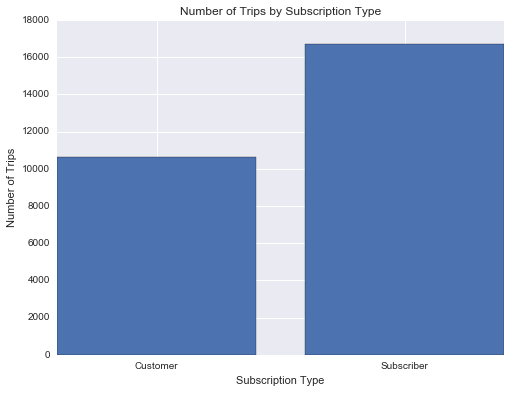
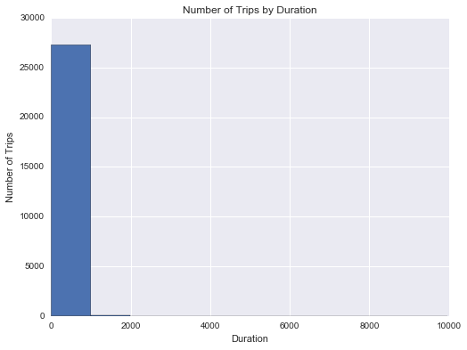
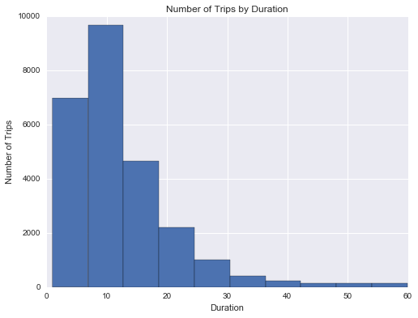
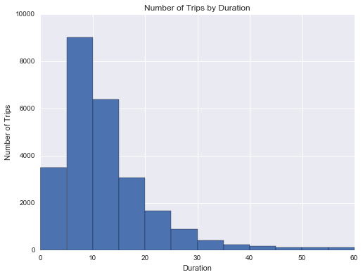
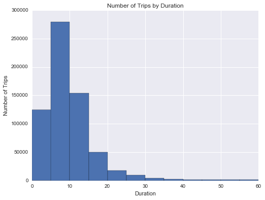
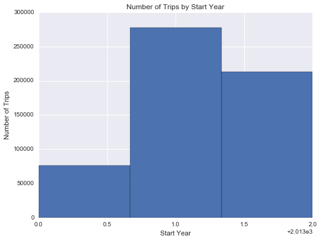
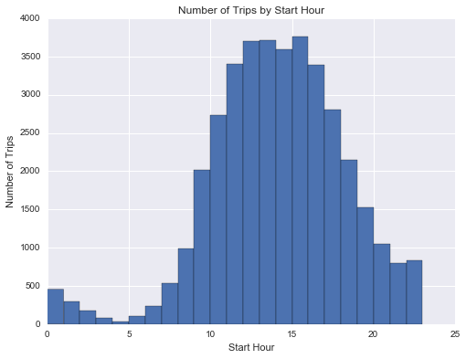
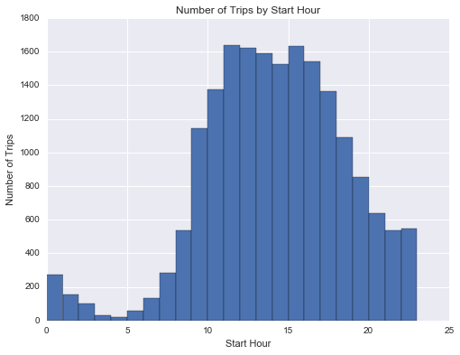
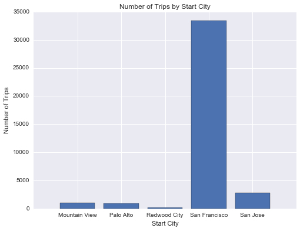

# Bay Area Bike Share Analysis

## Introduction


[Bay Area Bike Share](http://www.bayareabikeshare.com/) is a company that provides on-demand bike rentals for customers in San Francisco, Redwood City, Palo Alto, Mountain View, and San Jose. Users can unlock bikes from a variety of stations throughout each city, and return them to any station within the same city. Users pay for the service either through a yearly subscription or by purchasing 3-day or 24-hour passes. Users can make an unlimited number of trips, with trips under thirty minutes in length having no additional charge; longer trips will incur overtime fees.

In this project we get our bearings in an unfamiliar dataset. In this first analysis we wish to explore trip frequency and different parameters that can effect it.
First, we will create a subset of data that consists of the first month of trip data to see how the data behaves.
Next we will take a look at the station data and see if we can discover any useful relationships with the trip data.
Finally we will wrangle all the data into one csv table and perform some exploratory analysis and generate useful plots that can help describe the nature of that data.  


## Data Wrangling

 The data comes in three parts: the first half of Year 1 (files starting `201402`), the second half of Year 1 (files starting `201408`), and all of Year 2 (files starting `201508`). There are three main datafiles associated with each part: trip data showing information about each trip taken in the system (`*_trip_data.csv`), information about the stations in the system (`*_station_data.csv`), and daily weather data for each city in the system (`*_weather_data.csv`).

When dealing with a lot of data, it can be useful to start by working with only a sample of the data. This way, it will be much easier to check that our data wrangling steps are working since our code will take less time to complete. Once we are satisfied with the way things are working, we can then set things up to work on the dataset as a whole.

Since the bulk of the data is contained in the trip information, we should target looking at a subset of the trip data to help us get our bearings. We'll start by looking at only the first month of the bike trip data, from 2013-08-29 to 2013-09-30.


```python
# import all necessary packages and functions.
import csv
from datetime import datetime
import numpy as np
import pandas as pd
from babs_datacheck import question_3
from babs_visualizations import usage_stats, usage_plot
from IPython.display import display
# this attempts to make matplotlib run display inline, works in jupyter notebook
%matplotlib inline
```


```python
# file locations
file_in  = '201402_trip_data.csv'
file_out = '201309_trip_data.csv' # <-- to be subset file we write too

# open files with write and read privledges
with open(file_out, 'w') as f_out, open(file_in, 'r') as f_in:
    # set up csv reader and writer objects
    in_reader = csv.reader(f_in)
    out_writer = csv.writer(f_out)

    # write rows from in-file to out-file until specified date reached
    while True:
        datarow = next(in_reader)
        # trip start dates in 3rd column, m/d/yyyy HH:MM formats
        if datarow[2][:9] == '10/1/2013':
            break
        out_writer.writerow(datarow)
```

### Condensing the Trip Data

The first step is to look at the structure of the dataset to see if there's any data wrangling we should perform. The below cell will read in the sampled data file that you created in the previous cell, and print out the first few rows of the table.


```python
# Display the first few rows of the file we just created
print '\n\n\nTrip Data Subset file: 201309_trip_data.csv header: \n'
sample_data = pd.read_csv('201309_trip_data.csv')
display(sample_data.head())
```


    Trip Data Subset file: 201309_trip_data.csv header:


<div>
<table border="1" class="dataframe">
  <thead>
    <tr style="text-align: right;">
      <th></th>
      <th>Trip ID</th>
      <th>Duration</th>
      <th>Start Date</th>
      <th>Start Station</th>
      <th>Start Terminal</th>
      <th>End Date</th>
      <th>End Station</th>
      <th>End Terminal</th>
      <th>Bike #</th>
      <th>Subscription Type</th>
      <th>Zip Code</th>
    </tr>
  </thead>
  <tbody>
    <tr>
      <th>0</th>
      <td>4576</td>
      <td>63</td>
      <td>8/29/2013 14:13</td>
      <td>South Van Ness at Market</td>
      <td>66</td>
      <td>8/29/2013 14:14</td>
      <td>South Van Ness at Market</td>
      <td>66</td>
      <td>520</td>
      <td>Subscriber</td>
      <td>94127</td>
    </tr>
    <tr>
      <th>1</th>
      <td>4607</td>
      <td>70</td>
      <td>8/29/2013 14:42</td>
      <td>San Jose City Hall</td>
      <td>10</td>
      <td>8/29/2013 14:43</td>
      <td>San Jose City Hall</td>
      <td>10</td>
      <td>661</td>
      <td>Subscriber</td>
      <td>95138</td>
    </tr>
    <tr>
      <th>2</th>
      <td>4130</td>
      <td>71</td>
      <td>8/29/2013 10:16</td>
      <td>Mountain View City Hall</td>
      <td>27</td>
      <td>8/29/2013 10:17</td>
      <td>Mountain View City Hall</td>
      <td>27</td>
      <td>48</td>
      <td>Subscriber</td>
      <td>97214</td>
    </tr>
    <tr>
      <th>3</th>
      <td>4251</td>
      <td>77</td>
      <td>8/29/2013 11:29</td>
      <td>San Jose City Hall</td>
      <td>10</td>
      <td>8/29/2013 11:30</td>
      <td>San Jose City Hall</td>
      <td>10</td>
      <td>26</td>
      <td>Subscriber</td>
      <td>95060</td>
    </tr>
    <tr>
      <th>4</th>
      <td>4299</td>
      <td>83</td>
      <td>8/29/2013 12:02</td>
      <td>South Van Ness at Market</td>
      <td>66</td>
      <td>8/29/2013 12:04</td>
      <td>Market at 10th</td>
      <td>67</td>
      <td>319</td>
      <td>Subscriber</td>
      <td>94103</td>
    </tr>
  </tbody>
</table>
</div>


In this exploration, we wat to determine what affects the number of trips that are taken from users. Let's focus down on a few selected columns: the trip duration, start time, start terminal, end terminal, and subscription type. Start time will be divided into year, month, and hour components. We will also add a column for the day of the week and abstract the start and end terminal to be the start and end _city_.

Let's tackle the lattermost part of the wrangling process first. Run the below code cell to see how the station information is structured, then observe how the code will create the station-city mapping. Note that the station mapping is set up as a function, `create_station_mapping()`. Since it is possible that more stations are added or dropped over time, this function will allow us to combine the station information across all three parts of our data when we are ready to explore everything.


```python
print '\n\nStation Data file: 201402_station_data.csv header: \n'
# Display the first few rows of the station data file.
station_info = pd.read_csv('201402_station_data.csv')
display(station_info.head())


def create_station_mapping(station_data):
    """
    Create a mapping from station IDs to cities, returning the
    result as a dictionary.
    """
    station_map = {}
    for data_file in station_data:
        with open(data_file, 'r') as f_in:
            # set up csv reader object - note that we are using DictReader, which
            # takes the first row of the file as a header row for each row's
            # dictionary keys
            weather_reader = csv.DictReader(f_in)


            # this is tricky here
            # station_map['key'] = row['landmark'], where 'key' = row['station_id']
            for row in weather_reader:
                station_map[row['station_id']] = row['landmark']
    return station_map

```


    Station Data file: 201402_station_data.csv header:


<div>
<table border="1" class="dataframe">
  <thead>
    <tr style="text-align: right;">
      <th></th>
      <th>station_id</th>
      <th>name</th>
      <th>lat</th>
      <th>long</th>
      <th>dockcount</th>
      <th>landmark</th>
      <th>installation</th>
    </tr>
  </thead>
  <tbody>
    <tr>
      <th>0</th>
      <td>2</td>
      <td>San Jose Diridon Caltrain Station</td>
      <td>37.329732</td>
      <td>-121.901782</td>
      <td>27</td>
      <td>San Jose</td>
      <td>8/6/2013</td>
    </tr>
    <tr>
      <th>1</th>
      <td>3</td>
      <td>San Jose Civic Center</td>
      <td>37.330698</td>
      <td>-121.888979</td>
      <td>15</td>
      <td>San Jose</td>
      <td>8/5/2013</td>
    </tr>
    <tr>
      <th>2</th>
      <td>4</td>
      <td>Santa Clara at Almaden</td>
      <td>37.333988</td>
      <td>-121.894902</td>
      <td>11</td>
      <td>San Jose</td>
      <td>8/6/2013</td>
    </tr>
    <tr>
      <th>3</th>
      <td>5</td>
      <td>Adobe on Almaden</td>
      <td>37.331415</td>
      <td>-121.893200</td>
      <td>19</td>
      <td>San Jose</td>
      <td>8/5/2013</td>
    </tr>
    <tr>
      <th>4</th>
      <td>6</td>
      <td>San Pedro Square</td>
      <td>37.336721</td>
      <td>-121.894074</td>
      <td>15</td>
      <td>San Jose</td>
      <td>8/7/2013</td>
    </tr>
  </tbody>
</table>
</div>


```python
def summarise_data(trip_in, station_data, trip_out):
    """
    This function takes trip and station information and outputs a new
    data file with a condensed summary of major trip information. The
    trip_in and station_data arguments will be lists of data files for
    the trip and station information, respectively, while trip_out
    specifies the location to which the summarized data will be written.
    """
    # generate dictionary of station - city mapping
    station_map = create_station_mapping(station_data)

    with open(trip_out, 'w') as f_out:
        # set up csv writer object
        out_colnames = ['duration', 'start_date', 'start_year',
                        'start_month', 'start_hour', 'weekday',
                        'start_city', 'end_city', 'subscription_type']
        trip_writer = csv.DictWriter(f_out, fieldnames = out_colnames)
        trip_writer.writeheader()

        for data_file in trip_in:
            with open(data_file, 'r') as f_in:
                # set up csv reader object
                trip_reader = csv.DictReader(f_in)

                # collect data from and process each row
                for row in trip_reader:
                    new_point = {}

                    # convert duration units from seconds to minutes
                    ### Question 3a: Add a mathematical operation below   ###
                    ### to convert durations from seconds to minutes.     ###
                    new_point['duration'] = float(row['Duration'])/60

                    # reformat datestrings into multiple columns
                    ### Question 3b: Fill in the blanks below to generate ###
                    ### the expected time values.                         ###
                    trip_date = datetime.strptime(row['Start Date'], '%m/%d/%Y %H:%M')
                    new_point['start_date']  = trip_date.strftime('%Y-%m-%d')
                    new_point['start_year']  = trip_date.year
                    new_point['start_month'] = trip_date.month
                    new_point['start_hour']  = trip_date.hour
                    new_point['weekday']     = trip_date.weekday()

                    # remap start and end terminal with start and end city
                    new_point['start_city'] = station_map[row['Start Terminal']]
                    new_point['end_city'] = station_map[row['End Terminal']]
                    # two different column names for subscribers depending on file
                    if 'Subscription Type' in row:
                        new_point['subscription_type'] = row['Subscription Type']
                    else:
                        new_point['subscription_type'] = row['Subscriber Type']

                    # write the processed information to the output file.
                    trip_writer.writerow(new_point)
```

The following code will take the data contained in the files listed in the `trip_in` and `station_data` variables, and write a new file at the location specified in the `trip_out` variable. If you've performed the data wrangling correctly, the below code block will print out the first few lines of the dataframe and a message verifying that the data point counts are correct.


```python
# Process the data by running the function we wrote above.
station_data = ['201402_station_data.csv']
trip_in = ['201309_trip_data.csv']
trip_out = '201309_trip_summary.csv' # <-- new formatted output data file  
summarise_data(trip_in, station_data, trip_out)

# Load in the data file and print out the first few rows
sample_data = pd.read_csv(trip_out)
print 'Wrangled Data file: 201309_trip_summary.csv header \n'
display(sample_data.head())

# Verify the dataframe by counting data points matching each of the time features.
question_3(sample_data)
```

    Wrangled Data file: 201309_trip_summary.csv header


<div>
<table border="1" class="dataframe">
  <thead>
    <tr style="text-align: right;">
      <th></th>
      <th>duration</th>
      <th>start_date</th>
      <th>start_year</th>
      <th>start_month</th>
      <th>start_hour</th>
      <th>weekday</th>
      <th>start_city</th>
      <th>end_city</th>
      <th>subscription_type</th>
    </tr>
  </thead>
  <tbody>
    <tr>
      <th>0</th>
      <td>1.050000</td>
      <td>2013-08-29</td>
      <td>2013</td>
      <td>8</td>
      <td>14</td>
      <td>3</td>
      <td>San Francisco</td>
      <td>San Francisco</td>
      <td>Subscriber</td>
    </tr>
    <tr>
      <th>1</th>
      <td>1.166667</td>
      <td>2013-08-29</td>
      <td>2013</td>
      <td>8</td>
      <td>14</td>
      <td>3</td>
      <td>San Jose</td>
      <td>San Jose</td>
      <td>Subscriber</td>
    </tr>
    <tr>
      <th>2</th>
      <td>1.183333</td>
      <td>2013-08-29</td>
      <td>2013</td>
      <td>8</td>
      <td>10</td>
      <td>3</td>
      <td>Mountain View</td>
      <td>Mountain View</td>
      <td>Subscriber</td>
    </tr>
    <tr>
      <th>3</th>
      <td>1.283333</td>
      <td>2013-08-29</td>
      <td>2013</td>
      <td>8</td>
      <td>11</td>
      <td>3</td>
      <td>San Jose</td>
      <td>San Jose</td>
      <td>Subscriber</td>
    </tr>
    <tr>
      <th>4</th>
      <td>1.383333</td>
      <td>2013-08-29</td>
      <td>2013</td>
      <td>8</td>
      <td>12</td>
      <td>3</td>
      <td>San Francisco</td>
      <td>San Francisco</td>
      <td>Subscriber</td>
    </tr>
  </tbody>
</table>
</div>


    All counts are as expected!


## Exploratory Data Analysis

Now that we have wrangled some data to a file, let's look at some initial trends in the data. Some code has already been written for you in the `babs_visualizations.py` script to help summarize and visualize the data; this has been imported as the functions `usage_stats()` and `usage_plot()`. In this section we'll walk through some of the things you can do with the functions, and you'll use the functions for yourself in the last part of the project. First, run the following cell to load the data, then use the `usage_stats()` function to see the total number of trips made in the first month of operations, along with some statistics regarding how long trips took.


```python
trip_data = pd.read_csv('201309_trip_summary.csv') # <-- wrangled data

usage_stats(trip_data)
```

    There are 27345 data points in the dataset.
    The average duration of trips is 27.60 minutes.
    The median trip duration is 10.72 minutes.
    25% of trips are shorter than 6.82 minutes.
    25% of trips are longer than 17.28 minutes.


    array([  6.81666667,  10.71666667,  17.28333333])


You should see that there are over 27,000 trips in the first month, and that the average trip duration is larger than the median trip duration (the point where 50% of trips are shorter, and 50% are longer). In fact, the mean is larger than the 75% shortest durations. This will be interesting to look at later on.

Let's start looking at how those trips are divided by subscription type. One easy way to build an intuition about the data is to plot it. We'll use the `usage_plot()` function for this. The second argument of the function allows us to count up the trips across a selected variable, displaying the information in a plot. The expression below will show how many customer and how many subscriber trips were made.


```python
usage_plot(trip_data, 'subscription_type')
```





Seems like there's about 50% more trips made by subscribers in the first month than customers. Let's try a different variable now. What does the distribution of trip durations look like?


```python
usage_plot(trip_data, 'duration')
```





Looks pretty strange, doesn't it? Take a look at the duration values on the x-axis. Most rides are expected to be 30 minutes or less, since there are overage charges for taking extra time in a single trip. The first bar spans durations up to about 1000 minutes, or over 16 hours. Based on the statistics we got out of `usage_stats()`, we should have expected some trips with very long durations that bring the average to be so much higher than the median: the plot shows this in a dramatic, but unhelpful way.

When exploring the data, you will often need to work with visualization function parameters in order to make the data easier to understand. Here's where the third argument of the `usage_plot()` function comes in. Filters can be set for data points as a list of conditions. Let's start by limiting things to trips of less than 60 minutes.


```python
usage_plot(trip_data, 'duration', ['duration < 60'])
```





This is looking better! You can see that most trips are indeed less than 30 minutes in length, but there's more that you can do to improve the presentation. Since the minimum duration is not 0, the left hand bar is slighly above 0. We want to be able to tell where there is a clear boundary at 30 minutes, so it will look nicer if we have bin sizes and bin boundaries that correspond to some number of minutes. Fortunately, you can use the optional "boundary" and "bin_width" parameters to adjust the plot. By setting "boundary" to 0, one of the bin edges (in this case the left-most bin) will start at 0 rather than the minimum trip duration. And by setting "bin_width" to 5, each bar will count up data points in five-minute intervals.


```python
usage_plot(trip_data, 'duration', ['duration < 60'], boundary = 0, bin_width = 5)
```





Visual adjustments like this might be small, but they can go a long way in helping you understand the data and convey your findings to others.

## Performing Your Own Analysis

Now that we have a good understanding of the data samples, we can use the `summarise_data()` function to wrangle all the data available into one single file and explore the entire data set.  


```python
station_data = ['201402_station_data.csv',
                '201408_station_data.csv',
                '201508_station_data.csv' ]
trip_in = ['201402_trip_data.csv',
           '201408_trip_data.csv',
           '201508_trip_data.csv' ]
trip_out = 'babs_y1_y2_summary.csv' # <-- single wrangled data file from all csv files for two years
                                    # <-- we were able to do this by first wrangleing a smaller subset
                                    # of data into a desired format :), now its time to analize the full data set.

# This function will take in the station data and trip data and
# write out a new data file to the name listed above in trip_out.
summarise_data(trip_in, station_data, trip_out)
```

Our summarized data file has now been written in the 'babs_y1_y2_summary.csv' file.


```python
trip_data = pd.read_csv('babs_y1_y2_summary.csv')
print '\nNew Condensed Data File \n' # <-- header should match our smaller subset header
display(trip_data.head())
```


    New Condensed Data File


<div>
<table border="1" class="dataframe">
  <thead>
    <tr style="text-align: right;">
      <th></th>
      <th>duration</th>
      <th>start_date</th>
      <th>start_year</th>
      <th>start_month</th>
      <th>start_hour</th>
      <th>weekday</th>
      <th>start_city</th>
      <th>end_city</th>
      <th>subscription_type</th>
    </tr>
  </thead>
  <tbody>
    <tr>
      <th>0</th>
      <td>1.050000</td>
      <td>2013-08-29</td>
      <td>2013</td>
      <td>8</td>
      <td>14</td>
      <td>3</td>
      <td>San Francisco</td>
      <td>San Francisco</td>
      <td>Subscriber</td>
    </tr>
    <tr>
      <th>1</th>
      <td>1.166667</td>
      <td>2013-08-29</td>
      <td>2013</td>
      <td>8</td>
      <td>14</td>
      <td>3</td>
      <td>San Jose</td>
      <td>San Jose</td>
      <td>Subscriber</td>
    </tr>
    <tr>
      <th>2</th>
      <td>1.183333</td>
      <td>2013-08-29</td>
      <td>2013</td>
      <td>8</td>
      <td>10</td>
      <td>3</td>
      <td>Mountain View</td>
      <td>Mountain View</td>
      <td>Subscriber</td>
    </tr>
    <tr>
      <th>3</th>
      <td>1.283333</td>
      <td>2013-08-29</td>
      <td>2013</td>
      <td>8</td>
      <td>11</td>
      <td>3</td>
      <td>San Jose</td>
      <td>San Jose</td>
      <td>Subscriber</td>
    </tr>
    <tr>
      <th>4</th>
      <td>1.383333</td>
      <td>2013-08-29</td>
      <td>2013</td>
      <td>8</td>
      <td>12</td>
      <td>3</td>
      <td>San Francisco</td>
      <td>San Francisco</td>
      <td>Subscriber</td>
    </tr>
  </tbody>
</table>
</div>


```python
# Exploration Stats done here
usage_stats(trip_data)
```

    There are 669959 data points in the dataset.
    The average duration of trips is 18.47 minutes.
    The median trip duration is 8.62 minutes.
    25% of trips are shorter than 5.73 minutes.
    25% of trips are longer than 12.58 minutes.


    array([  5.73333333,   8.61666667,  12.58333333])


```python
# Exploration Plot done here
print 'Duration Plot'
usage_plot(trip_data, 'duration', ['duration < 60'], boundary = 0, bin_width = 5)

print '\n Number of Trips by Start Year from Subscribers'
usage_plot(trip_data, 'start_year', ["subscription_type == 'Subscriber'"], n_bins = 3)

print '\n Number of Trips by Start Hour on Weekends'
usage_plot(trip_data, 'start_hour', ['start_hour < 25', "weekday > 5"], bin_width = 1)

print '\n Number of Trips by Start Hour on Weekends from Subscribers'
usage_plot(trip_data, 'start_hour', ['start_hour < 25', "weekday > 5", "subscription_type == 'Subscriber'"], bin_width = 1)

print '\n Number of Trips by Location on Weekends'
usage_plot(trip_data, 'start_city', ["weekday > 5"])
```

    Duration Plot





     Number of Trips by Start Year from Subscribers





     Number of Trips by Start Hour on Weekends





     Number of Trips by Start Hour on Weekends from Subscribers





     Number of Trips by Location on Weekends





Below you will find some plots that I found most interesting.

```python
# Final Plot 1
print '\n Number of Trips by Start Year from Subscribers'
usage_plot(trip_data, 'start_year', ["subscription_type == 'Subscriber'"], n_bins = 3)
```


     Number of Trips by Start Year from Subscribers


 This plot shows the growth rate of Subscribers over the two year this data is taken from. Year 1 saw approximately 280,000 subscribers, while year 2 obtained appoximately 220,000 subscribers. This means that Bay Area Bike Share had a healthy retention rate of aproximately 79%. This is a nice metric that can help evaluate the sucess of a company.   


```python
# Final Plot 2
print '\n Number of Trips by Start Hour on Weekends'
usage_plot(trip_data, 'start_hour', ['start_hour < 25', "weekday > 5"], bin_width = 1)
```


     Number of Trips by Start Hour on Weekends


Since the Bay Area Bike Share business model does not depend on subscribers alone, this plot shows the number of trips on weekends by start hour. This plots shows that the majority of trips peak around 3pm on Saturdays and Sundays. This is a good indicator that users are using BABS on weekends throughout the day during the leisure hours between 11am and 4pm.

## Conclusions

In this exercise we took a completely unfamiliar data set and, over a series of small finite steps, we obtained useful results. Creating smaller subsets of data allows us to gain our bearing and create a foundational understanding of the data set. Once we have a decent idea of the data we can begin to formulate ideas and questions from the data. From these questions we can compose and wrangle the data into one data file. From this widely scoped wrangled data file we can perform accurate and useful exploratory analysis of the entire data set. Wrangling data and performing exploratory analysis is a crucial part of the data analysis process and should not be overlooked. The methods described in this document can allow us to fit the data to a model for making predictions, or performing a statistical tests.
In addition we could also look at how the weather data ties into bike usage, to create a better more complete analysis.


```python

```
